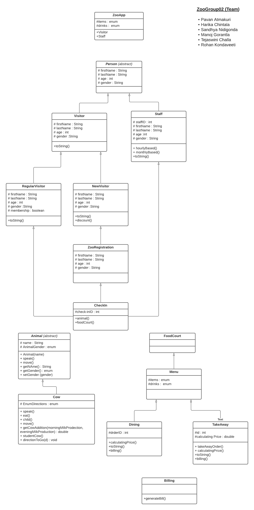

# Zoo02Group

> Welcome to our ZooRestaurant! 

A project of zooRestaurant implementation 

## API

- Explore API at <https://gorantla07.github.io/ZooRestaurant/docs/index.html>
- Generate API with `mvn javadoc:javadoc`

## CodeCoverage

- Explore API at <https://gorantla07.github.io/ZooRestaurentCodeCoverage/index.html>
- git repo Link for codecoverage <https://github.com/gorantla07/ZooRestaurentCodeCoverage>

Regenerate results periodically.

Open Powershell Here as Admininstrator in your root project folder (the one with pom.xml):
- Prepare test results with `mvn clean jacoco:prepare-agent install`
- Prepare coverage site with `mvn jacoco:report` 
- This builds target/site/jacoco which is then copied to the hosted repo above.

## INFO about Group

1. Name of our team:: ZooGroup02
2. Name of our app :: ZooRestaurant
3. Package we work under: edu.nwmissouri.zoo02group
4. Will you make a console app? Or a web app? :: console app
5. Display the UML class diagram -> drawn by: Harika Chintala

6. Group repo Created By :: Manoj Gorantla
7.  repo collaborators (full rights, accept PRs, etc.) :: 2 (Pavan Atmakuri, Harika Chintala) & how many contributors (working as they did in zoo04lab) :: 4(Manoj Gorantla, Rohan Kondaveeti, Sandhya Nidigonda, Tejaswini Challa)
8. The App main() method Created By: Pavan Atmakuri
9. first enum Created By :: Tejaswini Challa -> enum name:: items
10. second enum Created By:: Tejaswini Challa -> enum name:: drinks

> Listing the each group member + their classes

## Pavan Atmakuri :

- Person Abstract Class
- CheckIn Class
- ZooApp main class

## Manoj Gorantla :

- Visitor Class
- Staff Class 

## Rohan Kondaveeti :

- RegularVisitor Class
- NewVisitor Class 

## Harika Chintala :

- Animal List
- Person class

## Sandhya Nidigonda 

- OrderDrink
- OrderItem

## Tejaswini Challa :

- Items Enum class
- Drink Enum Class
- Billing Class
